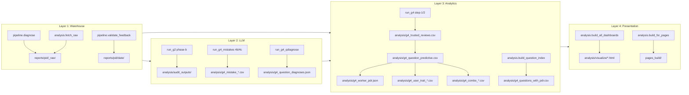

# Technical Handoff: OpenClaw Analysis Pipeline

Companion to [HANDOFF.md](./HANDOFF.md). This document covers:

1. Architecture (four layers + the data-trust chain).
2. The 26-step canonical sequence, with what reads/writes what.
3. External dependencies and secrets.
4. Cost model.
5. Known invariants and failure modes.
6. Recommended next investments.

---

## 1. Architecture

The pipeline has four layers, each with distinct dependencies and
failure modes:

Each layer has one canonical output shape that downstream layers read
from. The invariant is that **CSVs are per-project by directory**
(`reports/<pid>/_raw/*.csv`) but derived analytics are **global by
filename** (`analysis/g4_*.csv`). Switching between projects requires
archiving the global state to `archive/<project_id>/` — this is what
`archive_project.sh` automates.

### Layer 1: Warehouse pull

- **`pipeline.diagnose`**: runs Q-A through Q-E on Snowflake (via Redash),
  downloads CDS payloads (JSON blobs for every task attempt) from the
  dashboard, applies the promotion FSM
  (`pipeline/lib/fsm.py`-equivalent inside `diagnose.py`), and writes a
  dated report directory with the funnel, worker states, and per-worker
  time-to-stage curves. Cache: per-CSV mtime vs queue YAML mtime.
- **`analysis.fetch_raw`**: pulls the remaining warehouse tables (Q-F,
  Q-G1, Q-G2 for course psychometrics; G4 user-traits + user-baseline
  for trait correlation; a global tag-name reference). Split into
  `--phase pre-g4` (runs before trust filtering) and `--phase post-trust`
  (runs after, because it needs the trusted-reviewer cohort as a cohort
  filter in its SQL). Cache: file-existence only (a known limitation).
- **`pipeline.validate_feedback`**: reads `reports/<pid>/_raw/Q-C.csv`
  + the CDS cache, extracts `quality_overall_qms` scores from
  `QualityMeasurement` steps, and writes `review_validation.csv` +
  `reviewer_scorecard.csv` under the dated report directory.

### Layer 2: LLM dispatch

Three sub-layers, all pattern-matched: sample or materialize
per-record evidence bundles, dispatch to Claude via `subprocess`, cache
per-record outputs, aggregate at the end.

- **`run_g2 phase-a` → `phase-b` → `phase-c`**: the reviewer-feedback
  audit. Phase A samples 200 reviews (outlier-weighted + control-random).
  Phase B materializes each review's trinity bundle (prompt, rubric,
  trajectory, worker output) into `analysis/audit_inputs/<id>/` and
  dispatches an LLM sub-agent (Claude Opus, `--effort max`,
  `--json-schema` enforced) that returns a verdict per feedback claim
  plus an overall `feedback_defensible` / `feedback_questionable` /
  `feedback_unjustified` bucket. Phase C aggregates verdicts into a
  per-reviewer trust score.
- **`run_g4_mistakes` step-4b + step-4c**: mistake clustering. Step 4a
  extracts every "bad review" (QM ≤ 2 from a trusted reviewer) into
  a JSONL corpus. Step 4b LLM-clusters the corpus into named mistake
  categories with example task_attempt_ids. Step 4c LLM-scores every
  (cluster, course) pair on how well the course covers that mistake
  (0-3). This drives the "curriculum gaps" list.
- **`run_g4_qdiagnose diagnose`**: per-question root-cause diagnosis.
  For every question flagged `predictive` or `counterproductive`,
  materializes the question text + sample worker answers + grader hints,
  then dispatches an LLM sub-agent that returns a diagnosis class
  (`answer_key_broken` / `trait_misalignment_meta_skill` /
  `trait_misalignment_other` / `prompt_ambiguous` / `noise_or_low_signal`
  / `genuinely_predictive`) plus a `recommended_action`
  (`keep` / `rewrite` / `remove` / `investigate_grader`).

All three sub-layers write to `analysis/audit_outputs/`,
`analysis/g4_mistakes/`, and `analysis/g4_qdiagnose/` respectively.
None of these directories are project-namespaced today — see §5
"Cross-project bleed" below.

### Layer 3: Analytics

Pure Python (stdlib only; no pandas). Split across ~10 modules under
`analysis/run_g4_*.py` + `analysis/lib/*.py`.

Key output: `analysis/g4_question_predictive.csv`. Every row is a
(course, question) pair with:

- `pdr_pass`, `pdr_fail` — mean Performance Defect Rate for passers vs
  failers of the question.
- `r_pdr` — point-biserial correlation between passing the question
  and the worker's downstream PDR. Negative = predictive; positive =
  counterproductive.
- `r_pdr_ci95_lo`, `r_pdr_ci95_hi` — Fisher z 95% confidence interval.
- `predictive`, `counterproductive` — boolean flags at ±0.05 threshold.

Related outputs:

- **`g4_worker_pdr.json`**: per-worker PDR + tag membership.
- **`g4_worker_outcomes.json`**: per-worker outcome dict used by every
  downstream correlation runner.
- **`g4_user_trait_summary.json`**: per-trait + per-tag correlations
  with PDR (continuous, binary, categorical, tag-carrier).
- **`g4_combo_curves.json`**: per-course dose-response curves (workers
  who pass N of the K predictive questions in this course have mean PDR X).
- **`g4_tagcombo_subsets.csv`**: tag-bundle synergy analysis (do tags
  A+B together predict PDR better than either alone?).
- **`g4_q_subset_all.csv`**: per-course subset search for the best
  actionable "if a worker passes these 3 questions, PDR drops by 15pp"
  bundle.
- **`g4_questions_with_pdr.csv`**: the final per-question CSV with
  question text (from Q-G2 SECTIONS or Q-G1 worker samples or
  `COURSEV2VERSIONHISTORIES` for deprecated questions), correct answer,
  and every PDR statistic in one place. Body-provenance tagged via
  `body_source` column (`qg2_sections` / `qg1_sample` / `qg2_history`)
  and `deprecated` boolean.

### Layer 4: Presentation

Ten HTML dashboards from ~5 KLOC of static-HTML generators
(`analysis/build_*.py`). No client-side framework; the design system
is a single CSS token file at `analysis/visualize/_assets/design.css`
+ a vanilla-JS component library at `_assets/dashboard.js` (sortable
tables, filterable rows, tooltip modals).

The rendered dashboards:

- **`index.html`** — landing page with recommendations + theme tiles.
- **`summary.html`** — printable one-pager (funnel + reviewer trust +
  per-course predictive-vs-counterproductive bar).
- **`themes/{courses,questions,reviewers,workers}.html`** — the
  cross-cutting workhorse pages.
- **`g1.html`** — Goal 1: funnel + gate enforcement + KM survival +
  stuck workers.
- **`g2.html`** + **`g2_distributions.html`** + **`g2_audit_review.html`**
  — Goal 2: reviewer trust, distribution histograms, per-audit evidence.
- **`g3.html`** + **`g3_production_validity.html`** — Goal 3: course
  psychometrics + PDR-anchored discrimination scatter.
- **`g4.html`** — Goal 4: 10-step deep-dive with methodology + caveats
  for every number.
- **`g_universe_coverage.html`** — Phase 0: RL env acquisition
  priority.

`analysis.build_for_pages` produces a redacted copy in `pages_build/`
that hashes worker emails + Mongo IDs and omits the audit-evidence
viewer (100 MB with raw feedback embedded).

---

## 2. The 26-step canonical sequence

Run via `python3 -m analysis.run_all --queue queues/<project_id>.yaml`.
Each step is a `subprocess.run` of the next canonical module.
`--from`, `--only`, `--skip`, `--skip-llm`, `--force`, `--dry-run`,
`--list` flags supported.

| Step | Module | Wall time | LLM cost |
|------|--------|-----------|----------|
| B1 | `pipeline.diagnose` | 3-6 min | — |
| B2 | `pipeline.validate_feedback` | 1-2 min | — |
| B3 | `analysis.fetch_raw --phase pre-g4` | 1-2 min | — |
| C1 | `analysis.run_env_coverage` | 30 s | — |
| C2 | `analysis.run_g1` | 30 s | — |
| C3 | `analysis.run_g2 phase-a` | 10 s | — |
| **C4** | **`analysis.run_g2 phase-b` (LLM)** | **15-25 min** | **~$300** |
| C5 | `analysis.run_g2 phase-c` | 10 s | — |
| C6 | `analysis.run_g3` | 30 s | — |
| C8 | `analysis.run_g4 step-1` | 20 s | — |
| C8b | `analysis.fetch_raw --phase post-trust` | 1 min | — |
| C9 | `analysis.run_g4 step-2` | 1-2 min | — |
| C10 | `analysis.run_g4_mistakes step-4a` | 30 s | — |
| **C11** | **`analysis.run_g4_mistakes step-4b` (LLM)** | **3-5 min** | **~$20** |
| **C12** | **`analysis.run_g4_mistakes step-4c` (LLM)** | **2-3 min** | **~$15** |
| C13 | `analysis.run_g4_mistakes step-5` | 10 s | — |
| C15 | `analysis.run_g4_pdr` | 20 s | — |
| C16 | `analysis.run_g4_traits` | 30 s | — |
| C17 | `analysis.run_g4_combos` | 30 s | — |
| C18 | `analysis.run_g4_tagcombos` | 30 s | — |
| C19 | `analysis.run_g4_q_subsets` | 1 min | — |
| C20 | `analysis.run_g4_qdiagnose extract` | 20 s | — |
| C21 | `analysis.run_g4_qdiagnose stats` | 10 s | — |
| **C22** | **`analysis.run_g4_qdiagnose diagnose` (LLM)** | **5-10 min** | **~$30** |
| C23 | `analysis.build_question_index` | 30 s | — |
| D | `analysis.build_all_dashboards --skip-goals` | 3 s | — |

**Fresh-project totals:** ~25-40 minutes wall time, ~$365 LLM cost.
**Presentation-only re-run** (edit copy, tweak layout): ~3 seconds.
**Data refresh with existing audits cached**: ~5 minutes, ~$30-$50
(the LLM sub-layers cache per-attempt / per-question, so only new
records incur cost).

Every C-step reads from and writes to the `analysis/` directory.
Steps marked `always=True` in `run_all.py` never skip (currently:
B2, C10, C20, C21, C22, D). Everything else is checkpointed by mtime.

---

## 3. External dependencies and secrets

### Secrets (loaded from `.env` via `python-dotenv`)

| Variable | Purpose | Rotation |
|----------|---------|----------|
| `REDASH_API_KEY` | Snowflake pulls via Redash API | Manual; rare |
| `SCALE_DASHBOARD_JWT` | CDS payload downloads (JWT cookie) | **~24 hours** |
| `SCALE_DASHBOARD_CSRF` | CDS transform requests (header) | **~24 hours** |
| `SCALE_DASHBOARD_CSRF_COOKIE` | CDS transform requests (cookie) | **~24 hours** |
| `RL_ENVS_DIR` (optional) | Local RL universe zips path | — |

The three dashboard cookies are the operational sore point. When they
expire, B1's CDS pull fails with HTTP 401, and every downstream step
that reads the CDS cache degrades. Refresh procedure is documented in
`ONBOARDING.md` step 2.

### External services

- **Redash** at `https://redash.scale.com`. Data source id 22 for
  chatv2, 30 for MM. Occasional 503s from Redash itself (~5 minutes
  of downtime observed during MM onboarding).
- **Scale Dashboard** at `https://dashboard.scale.com`. CDS transform
  endpoint returns pre-signed S3 URLs for per-attempt JSON blobs.
- **Anthropic Claude CLI** (`claude`). Installed via
  `npm install -g @anthropic-ai/claude-code`. Called with
  `--json-schema` for every LLM audit. The pipeline assumes the CLI is
  on `PATH` and authenticated at machine level.
- **Snowflake** (via Redash) — table shape documented in
  `exploration/SCHEMA_NOTES.md`. Most critical: `taskattempts` uses
  `ATTEMPTED_AT_REVIEW_LEVEL` (VARIANT, `-1`/`0`/`1` for
  annotator/L1/L2), not `REVIEW_LEVEL`. No tag-name lookup table
  exists in the warehouse — semantic tag names must be supplied per
  queue via the YAML.

### Local dependencies

Python 3.13+. No `requirements.txt` intentionally (all stdlib except
`pyyaml`, `requests`, `python-dotenv`, `plotly` via CDN, `chardet`
transitively).

---

## 4. Cost model

Cost breakdown per fresh-project run (based on chatv2 numbers):

- **G2 phase-b (LLM)**: ~$300. 200 audits × ~$1.50 each. Per-attempt
  cache at `analysis/audit_outputs/<id>.json`. Re-running phase-b
  skips every cached audit, so a refresh after adding N new reviews
  costs N × $1.50, not $300.
- **G4 mistakes step-4b (LLM)**: ~$20. Single LLM call that clusters
  the entire bad-review corpus in one shot. **No cache today** — a
  re-run always re-clusters.
- **G4 mistakes step-4c (LLM)**: ~$15. One call per (cluster, course)
  pair. **No cache today.**
- **G4 qdiagnose (LLM)**: ~$30. One call per predictive/counterproductive
  question. Per-question cache at
  `analysis/g4_question_diagnoses.json`. Re-running skips already-
  diagnosed questions.
- **Snowflake compute**: negligible (< $1). Most heavy is Q-G1 which
  scans `courseprogressv2` for the configured courses.
- **Engineer time**: 25-40 minutes wall clock on a fresh run. ~3
  seconds for presentation-only re-runs.

The `--skip-llm` flag on `analysis.run_all` drops all four LLM steps.
Useful for cheap iteration on the analytics + presentation layers.

---

## 5. Invariants + known failure modes

### Invariants the pipeline assumes

1. **Attempt IDs are globally unique across projects.** Used as
   cache keys in `analysis/audit_outputs/`. Two projects with a
   shared attempt ID would produce a cross-contaminated audit.
2. **`review_level` maps to `-1` / `0` / `1` for annotator / L1 / L2.**
   Both audited projects use this convention. New projects with
   different conventions need `review_levels` in the queue YAML
   set correctly.
3. **The QM score field is `quality_overall_qms`.** Hardcoded in
   analytics as the numeric outcome. New projects using a different
   score field name need to update `promotion.reviewer_promotion.score_field`
   in the queue YAML AND update the analytics readers (currently a
   hard-code in `analysis/lib/trust.py` and `analysis/run_g4.py`).
4. **`courseprogressv2.course_grade.finalGrade` is the pass gate**,
   with `coursev2.passing_grade_threshold` as the threshold. Both
   projects use this shape.
5. **Reviewers must have ≥5 audits before we compute trust.** Below
   this, trust score is imputed to 0.5. Configurable via `run_g4 step-1
   --min-audits-to-drop`.

### Failure modes observed (all documented in git log)

Three "fix" commits capture the pattern:

1. **`a1c566c` — Supplementary courses silently dropped.**
   `q_a` / `q_g1` / `q_g2` SQL builders filtered on `onboarding +
   reviewer` only; `courses.supplementary` was ignored. Result: an
   entire course was invisible to the analysis. Fix: `Queue.all_courses`
   / `Queue.all_course_ids` properties, used everywhere.
2. **`db7224a` — Body cache not refreshed.** `build_question_index`
   wrote `g4_questions_with_pdr.csv` but not `g4_question_bodies.json`
   (which dashboards read). Result: dashboards showed "question text
   not in Q-G2 SECTIONS export" for 21 questions. Fix: build_question_index
   now writes both.
3. **`e9f8e0d` — Hardcoded defaults.** `run_g4 step-1 --report-date`
   defaulted to the chatv2 diagnose date; `run_g4_pdr` hardcoded
   the chatv2 tag IDs; `run_env_coverage` hardcoded a user's local
   RL envs path. Fix: auto-pick latest diagnose dir per project;
   read tags from queue; read RL envs from `RL_ENVS_DIR` env var.

All three are the same underlying pattern: **stale-data-without-
failing-the-build**. Local logic is correct at every step; the
composition is wrong because no manifest ties outputs to
`(project_id, queue_hash, rubric_hash, warehouse_snapshot)`.

### Cross-project bleed (still present today)

The following files are shared globally across projects. Running the
pipeline for project A after project B overwrites project B's outputs:

- All `analysis/g*_*.csv` and `analysis/g*_*.json`.
- All `analysis/visualize/*.html`.
- `analysis/audit_outputs/`, `audit_inputs/`, `audit_logs/`,
  `g4_mistakes/`, `g4_qdiagnose/`.
- `analysis/g4_tag_names.csv` (fetched globally, not per-project).
- `pages_build/` (a single site, one project at a time).
- The `analysis/grading_rubric.md` symlink (points at one project's
  rubric).

Workflow today: run project A → `archive_project.sh` snapshots
everything to `archive/A/` → run project B → snapshot to `archive/B/`
if switching back. Costly by hand; the archive script automates it.

---

## 6. Recommended next investments

Ranked by leverage. Everything below is optional; nothing here is
blocking a third-project onboarding.

### High leverage

1. **Namespace derived artifacts** (`artifacts/<project_id>/`
   subdirectories for every g*_*.csv, audit_output, dashboard).
   Removes the archive-and-restore ceremony entirely. Effort: ~2 days.
2. **Manifest per artifact** — a small JSON next to each output CSV
   containing `project_id`, queue YAML hash, rubric hash, input file
   hashes, schema version. Every reader verifies before consuming.
   Would have prevented all three "fix" commits above. Effort: ~2
   days on top of #1.
3. **Cache invalidation on queue YAML mtime** for `fetch_raw`. Today
   `fetch_raw` skips if the output file exists; it does not notice a
   queue YAML edit. Effort: ~1 hour.

### Medium leverage

4. **Auto-refresh the dashboard cookies** — or fail-fast with a
   clear message when the JWT is expired. Currently the pipeline
   runs partway through B1 before hitting a 401. Effort: half a day.
5. **Cache G4 mistakes step-4b/4c outputs.** Currently every re-run
   pays ~$35. Effort: 1-2 hours (input-hash based cache).
6. **Presentation builders take `--queue`.** Kills the `latest_diagnose_dir(None)`
   cross-project bleed. Would touch `build_themes.py`, `build_summary.py`,
   `build_g4_dashboard.py`. Effort: half a day.

### Lower leverage (nice to have)

7. **Schedule the refresh loop.** No cron / GitHub Action today.
   Adding one is straightforward once the cookies + Redash outages
   are handled gracefully.
8. **Cost telemetry per project.** `analysis/g2_audit_usage.csv`
   captures G2 phase-b cost; the other LLM steps don't emit a
   cost log. A unified cost report per project per refresh would
   help budgeting.
9. **Reviewer trust re-computation on demand.** Currently trust is
   a run-time output of `run_g4 step-1`, recomputed from all cached
   audit outputs on every run. As the audit corpus grows this will
   slow; consider an incremental update pattern.

---

## 7. Reference: what changes per project

Everything below varies per project. Everything else in the codebase
is project-independent.

- `queues/<project_id>.yaml` — 11 required fields (see
  `queues/_TEMPLATE.yaml`).
- `analysis/rubrics/<project_id>_<slug>.md` — the LLM auditor's
  rubric for this project.
- `.env` — three or four secrets, none project-specific but rotated
  regularly.
- `RL_ENVS_DIR` — optional local path to RL universe zips.

Everything else (all Python, all SQL builders, the design system,
`run_all` orchestrator, `ONBOARDING.md`) is written to work
generically. Adding a third project should not require code changes
in the ideal case.
